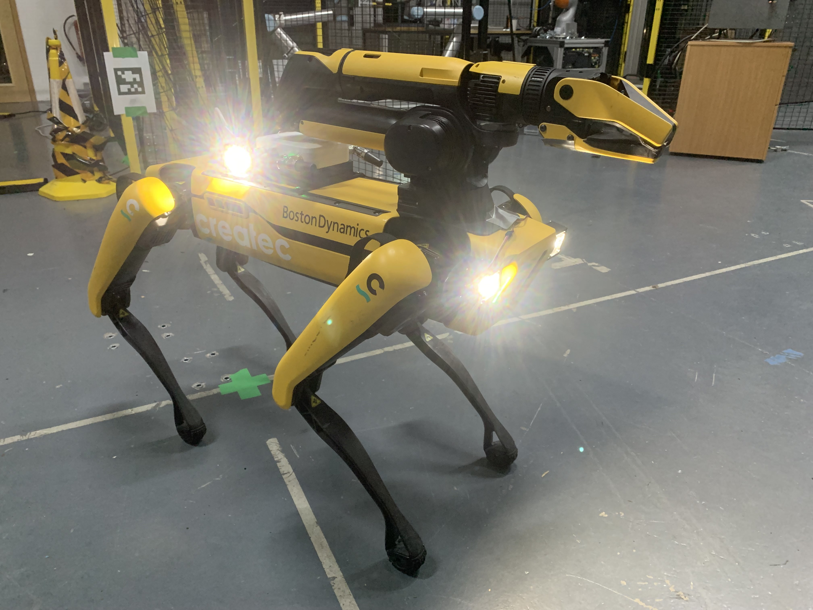

# Introduction

The OSE Robot PoE Switch allows the user to easily integrate a Rajant ES1, DX2 and Cardinal or other PoE dependant device to their robotics platform. Two versions of the Robot PoE Switch are available, OEM and Spot. The OEM is intended for third party integrations and the Spot is intended to be mounted on a Boston Dynamics Spot.

# Spot version specifications

The OSE Robot PoE Switch (stand alone) allows the user to easily integrate a Rajant ES1 on to a Boston Dynamics spot robot, with or without a GXP (General Expansion Payload). The standalone version allows the user to securely mount an ES1 to the robot, and provides networking in the same fashion aa the Core / EAP / OEM versions. Additional options are available for the standalone version, depending on customer requirements. 

-  GXP elimination circuitry (removes the need for customer to provide a GXP)
- Powers and provides mounting solution for Rajant ES1 and Rajant Cardinal
- Optional Smart lights controlled via webserver - provides lighting for robot - note, secondary PoE+ is removed if this is specified
- Secondary PoE+ output for use with PoE+ devices such as Fluke SV600 - note, Smart lights cannot be specified along with this option

# OEM version specifications

Intended for third party integration applications. The OEM option provides the following:

- 12-27V input (if PSU is specified, 5V if not)
- 10/100 Mbps networking with 4 Ethernet ports (1 PoE capable).
-  Mounting for Rajant Cardinal
- Low profile design 

# Risk Assessment

https://chick92.github.io/Risk_Assessment_usage_switch.pdf

# Certifications

##### CE

https://chick92.github.io/CE_robot_poe_switch.pdf

##### UKCA

https://chick92.github.io/UKCE_Robot_PoE_Switch.pdf

# Warnings

- Do not disassemble device, warranty will be void if device is tampered with.
- Do not short power terminals
- Do not exceed the specified input voltage

# Spot Version

The following is provided with the standalone unit:

1x 15 cm Ethernet cable
4x M5 10 mm Hex bolts
4x M5 T nuts
2x M4 6 mm Hex bolts for Rajant ES1
2x M6 25 mm Hex bolts for Rajant Cardinal

##### Smart Lights

Smart lights can be configured at the expense of the PoE+ hardware.

To use the Smart lights option, first connect the lights up using the provided cables. The front two lights can be positioned on the robot nose using the provided double sided sticky tape. The rear lights can either be positioned on the top rails or positioned on the rear mounting points using the provided M5 bolts. The user can specify the orientation, although it is recommended to ignore the side cameras as these are seldom used for navigation via teleportation. 

Once the lights are connected up, connect up using the included extension cables, connect them to the Robot PoE lighting port, following the cable colour order printed above the port, i.e white / orange under the W / O, red under the R and brown / black under the B / B.

The webserver to control the smart lights can be accessed on any web browser capable device on the same LAN as the Spot. Navigate to the following IP address:

192.168.50.124

This will allow you to switch the lights on and off. 
##### Mounting Rajant Cardinal or Rajant ES1

Rajant ES1 and Cardinal breadcrumbs can be mounted on to the top of the Robot PoE Switch, using the provided bolts. M4 for the ES1 and M6 for the Cardinal. 

Use only the bolts provided with the Robot PoE Switch as they are of a specified length.

##### Mounting on Spot

The Robot PoE Switch is designed to be mounted on the top of a Boston Dynamics spot, and as such is compatible with the payload rail spacing. Use the included M5 T-Nuts and M5 bolts. It is recommended to use loctite if available, and torque to hand-tight.

Once mounted, you will need to add the payload credentials to Spot

- Power on the robot, and log into the admin console using the admin credentials
- Go to the payload section and click "new custom payload"
- Enter "RobotPoESwitch" as the name
- Enter "OSE Rajant Robot PoE switch with ES1" as the description
- or X, Y and Z positions, enter -0.38, 0, 0.08 respectively. Note that if you're doing this on the Samsung Active Tab3 tablet, you'll need to use a notepad to type a "-" symbol, as at the time of writing Android 10 treats the field as number entry only.
- Enter 0,0,0 for Roll Pitch and Yaw
- Enter 0.5 kg for payload mass
- Enter 0,0,0 for position of centre of mass
- Leave as "point mass"

##### Secondary PoE+ output

The Robot PoE Switch PoE+ output allows the user to power and network with additional PoE+ enabled sensors such as the Fluke SV600, without additional interface hardware. 
The PoE+ output is found at the rear of the device, above the payload interface cable. Simply connect an Ethernet cable from this port to your sensor. 

# OEM version mounting information

