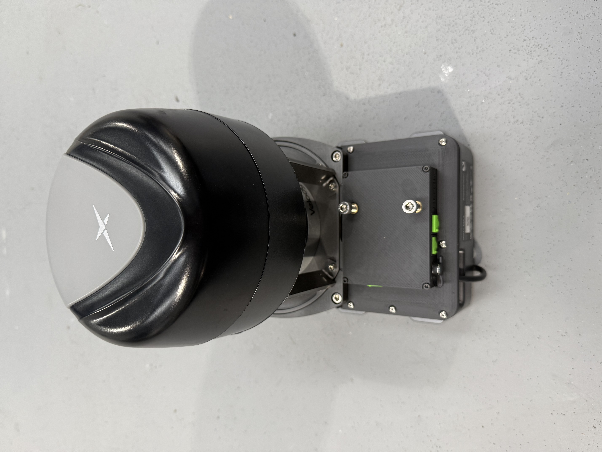
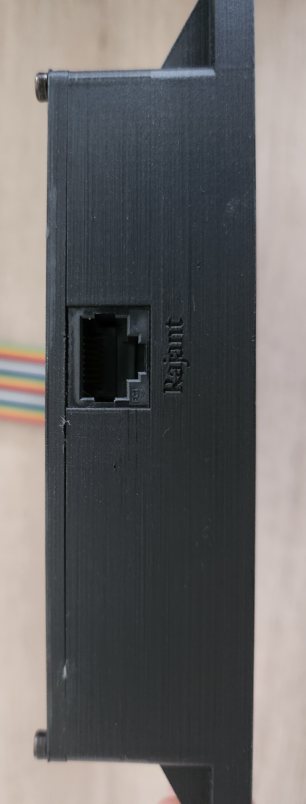

# Introduction

The OSE Robot PoE Switch allows the user to easily integrate a Rajant ES1, DX2 and Cardinal or other PoE dependent device to their robotics platform. Three versions of the Robot PoE Switch are available, OEM, COREIO / EAP2 and Spot Payload. The OEM is intended for third party integrations, the COREIO / EAP2 is designed to mount onto the Boston Dynamics COREIO / EAP2 and the Spot Payload is intended is intended to be mounted on a Boston Dynamics Spot, and interface directly to the robot.

# Specifications - OEM

Intended for third party integration applications. The OEM option provides the following:

- 10/100 Mbps networking with 4 Ethernet ports (1 PoE capable, 1 internal).
- Mounting for Rajant Cardinal
- Low profile design 
- Ingress protection IP54
- Operating environment -20 C to 45 C

# Specifications - COREIO / EAP2

The OSE Robot PoE Switch - COREIO / EAP2 allows the user to easily integrate a Rajant ES1  Boston Dynamics COREIO or EAP2, which is then mounted onto Spot. This frees up room on the back of the robot for additional payloads, and allows the mounting of both an EAP2 and a SpotCam. 

- Powers and provides mounting solution for Rajant Cardinal
- 3x 10/100 Mbit Ethernet (RJ45) with dust caps
- 1x 24 V DC output (2.1x5.5 mm) with dust cap
- Ingress protection IP54
- Operating environment -20 C to 45 C

# Specifications - Spot Payload

The OSE Robot PoE Switch - Spot Payload allows the user to easily integrate a Rajant ES1 or Cardinal on to a Boston Dynamics spot robot, with or without a GXP (General Expansion Payload). The standalone version allows the user to securely mount an ES1 to the robot, and provides networking to the robot as well as additional Ethernet and power outputs for additional payloads. Also included is a PoE+ output for powering and networking to a Fluke SV600. 

- GXP elimination circuitry (removes the need for customer to provide a GXP)
- Powers and provides mounting solution for Rajant ES1 and Rajant Cardinal
- Secondary PoE+ output for use with PoE+ devices such as Fluke SV600
- 3x 10/100 Mbit Ethernet (RJ45) with dust caps
- 1x 12 V DC output (2.1x5.5 mm) with dust cap
- Ingress protection IP54
- Operating environment -20 C to 45 C

# Risk Assessment

https://chick92.github.io/robot_poe_switch_instructions/Risk_Assessment_usage_switch.pdf

# Certifications

##### CE

https://chick92.github.io/robot_poe_switch_instructions//CE_robot_poe_switch.pdf

##### UKCA

https://chick92.github.io/robot_poe_switch_instructions//UKCE_Robot_PoE_Switch.pdf

# Warnings

- Do not disassemble device, warranty will be void if device is tampered with.
- Do not short power terminals
- Do not exceed the specified input voltage

# COREIO / EAP2 Instructions

The RPS COREIO / EAP2 switch will come with the following items:

- 2x M6 25 mm Hex bolts (mounting rajant cardinal)
- 1x 200 mm Ethernet cable (interfacing RPS to rajant cardinal)
- 3x Silicone dust caps (to cover RJ45 Ethernet ports)

Built into the unit is the DC power cable and Ethernet cable, these are to be connected to the COREIO / EAP2 DC expansion bus (CM4 connector) and Internal Ethernet port. 

To mount the RPS, first remove the top plate of the COREIO / EAP2. Ensure you keep the screws. DO NOT use power tools for this job, as the screws are made of soft metal and will be damaged. 

Next, remove the CN4 connector, using a flat head screw driver (you may need to use some needle nose pliers to do this, as it is a tight fit).

The DC power cable of the RPS switch connects to the COREIO using the CN4 connector, via the following pins:

- White - 24V - Pin 2
- Red - 5V - Pin 5
- Black - GND - Pin 7

Next, insert the Ethernet cable from the RPS switch into Eth 2 of the COREIO / EAP2

Now the RPS can be mounted to the COREIO. Place it on top and lever it in place. Note that rear of the unit needs to get over the lip of the COREIO. This is achieved when the holes line up, which is visible through the screw holes of the RPS switch. Once lines up, screw the unit into place with the screws from the original blanking plate. Screw to hand tight, DO NOT use power tools. You will have one screw left over. Place this and the original plate somewhere safe. 

The Rajant cardinal can now be mounted on to the unit using the M6 bolts. Ensure you use suitable loctite to secure them. Connect the rajant up to the switch using the included 200 mm Ethernet cable. This cable plugs into the port marked "Rajant".

The COREIO assembly can now be mounted onto Spot. 

# Spot Payload Instructions

The following is provided with the standalone unit:

- 1x 15 cm Ethernet cable
- 4x M5 10 mm Hex bolts
- 4x M5 T nuts
- 2x M4 6 mm Hex bolts for Rajant ES1
- 2x M6 25 mm Hex bolts for Rajant Cardinal

# Mounting Rajant Cardinal or Rajant ES1

Rajant ES1 and Cardinal breadcrumbs can be mounted on to the top of the Robot PoE Switch, using the provided bolts. M4 for the ES1 and M6 for the Cardinal. 

Use only the bolts provided with the Robot PoE Switch as they are of a specified length.

Connect the Rajant Cardinal or ES1 to the Ethernet output labeled "Rajant". DO NOT connect it to the Silver Ethernet output labeled "PoE+" as this is an Active PoE output and WILL NOT power the Rajant.

# Mounting on Spot

The Robot PoE Switch is designed to be mounted on the top of a Boston Dynamics spot, and as such is compatible with the payload rail spacing. Use the included M5 T-Nuts and M5 bolts. It is recommended to use loctite if available, and torque to hand-tight.

Once mounted, you will need to add the payload credentials to Spot

- Power on the robot, and log into the admin console using the admin credentials
- Go to the payload section and click "new custom payload"
- Enter "RobotPoESwitch" as the name
- Enter "OSE Rajant Robot PoE switch with ES1" as the description
- or X, Y and Z positions, enter -0.38, 0, 0.08 respectively. Note that if you're doing this on the Samsung Active Tab3 tablet, you'll need to use a notepad to type a "-" symbol, as at the time of writing Android 10 treats the field as number entry only.
- Enter 0,0,0 for Roll Pitch and Yaw
- Enter 0.5 kg for payload mass
- Enter 0,0,0 for position of centre of mass
- Leave as "point mass"

# Secondary PoE+ output

The Robot PoE Switch PoE+ output allows the user to power and network with additional PoE+ enabled sensors such as the Fluke SV600, without additional interface hardware. 
The PoE+ output is found at the rear of the device, above the payload interface cable. Simply connect an Ethernet cable from this port to your sensor. 

This output is labeled as PoE+. Do not connect the Rajant to this, as it will not work, and could potentially damage the Rajant. 

# OEM version mounting information

